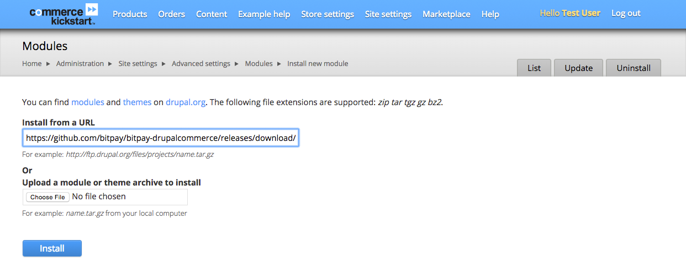
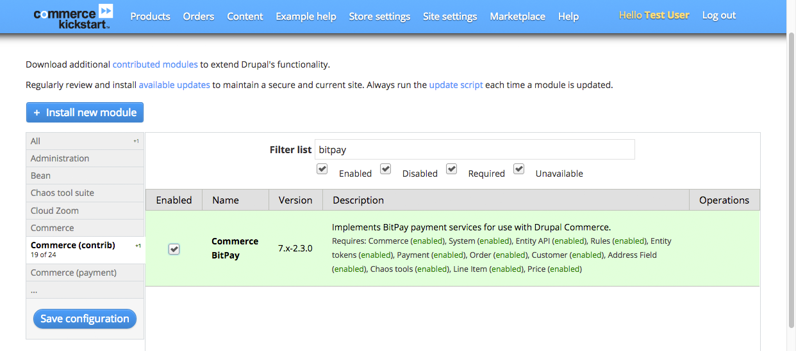
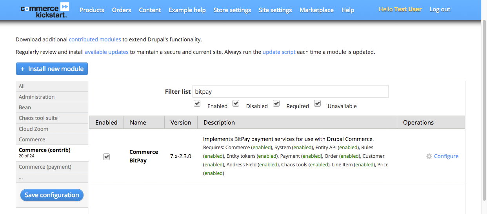
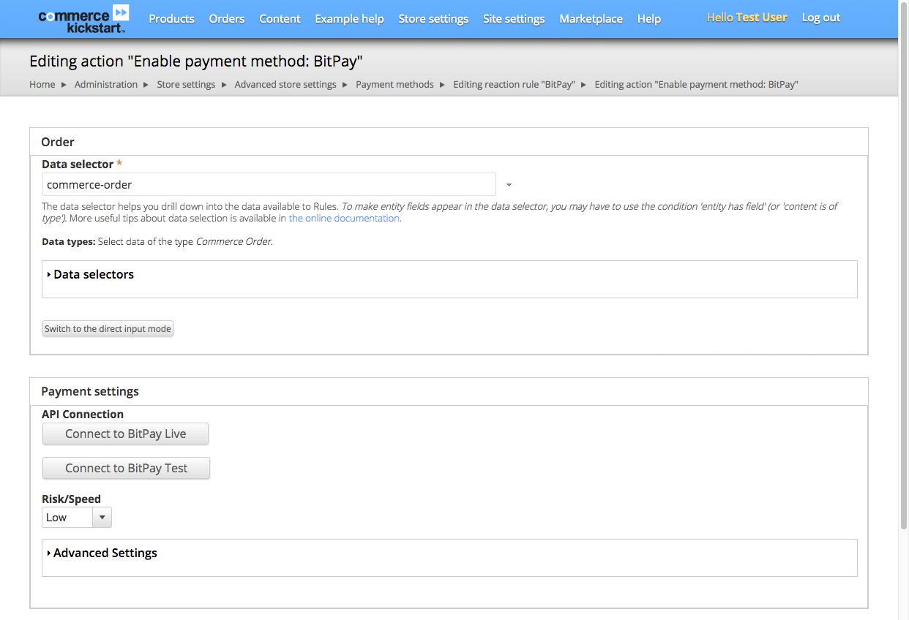
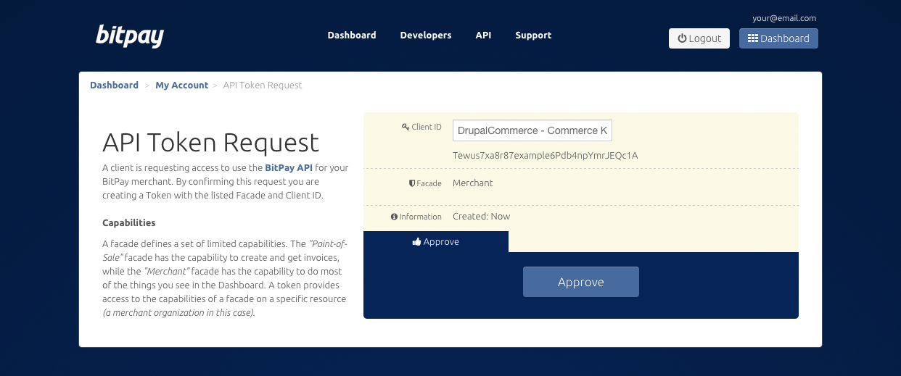
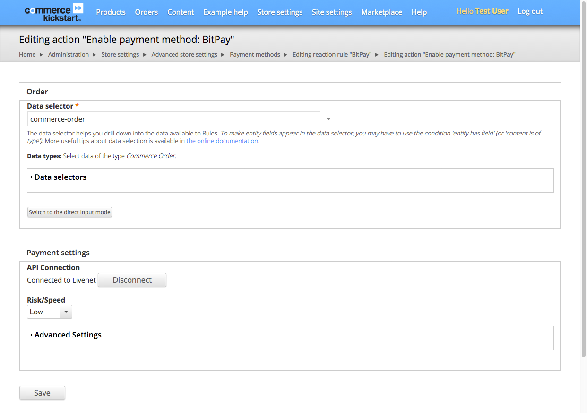
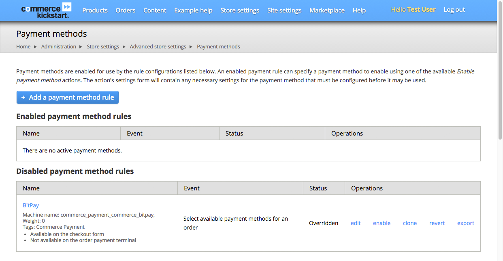
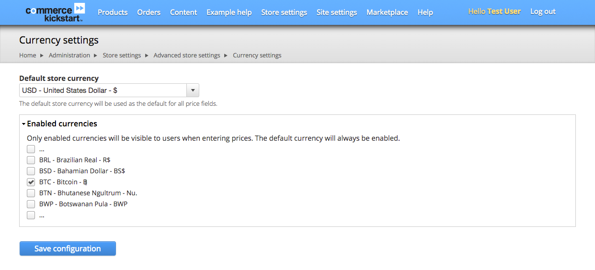

## Integration Requirements
Get started by [signing up for a BitPay merchant account.](https://bitpay.com/dashboard/signup)

You must also already be using the [Drupal Commerce software framework](https://drupalcommerce.org/download) for your e-commerce site.

View the [server requirements](https://github.com/bitpay/bitpay-drupalcommerce/blob/master/GUIDE.md#server-requirements) for this plugin

## Installing the plugin

1. Go to "Administration" > "Site Settings" > "Advanced Settings" > "Modules" > "Install New Module."
2. In "Install from a URL", enter `bitpay/bitpay-drupalcommerce/releases/download/v2.3.0/commerce_bitpay-7.x-2.3.0.zip.` Click "Install" to finish.

3. Go to **"Administration" > "Site Settings" > "Advanced Settings" > "Modules."**

4. Type bitpay into the filter or search for the module in the Commerce (contrib) tab.

5. Check "Enabled" and then click "Save Configuration."

## Connecting BitPay and Drupal Commerce
1. Scroll back to "Commerce BitPay", and click the "Configure" link to go to the BitPay Configuration Page.

2. At the BitPay Configuration Page, click "Connect To BitPay Live", or "Connect To BitPay Test." You may be prompted to sign into your BitPay account to continue.

3. At BitPay's API Token Request page, click "Approve."

4. You will be returned to the BitPay Configuration Page on your Drupal Commerce site. You should see confirmation that your site is either "Connected to Livenet" or "Connected to Testnet."

5. Go to "Administration" > "Store Settings" > "Advanced Store Settings" > "Payment Methods."

6. Under "Disabled Payment Method Rules," find "BitPay" and click "Enable."

Nice work! Your customers will now be able to check out with bitcoin on your Drupal Commerce site.

## Advanced Setup

### Transaction Speed Settings

1. You will have the option to select a transaction speed setting on your BitPay Configuration Page.

This setting only affects the time after which BitPay considers the payment fully confirmed and irrevocable on the Bitcoin network. You and your customer will be immediately notified when a payment is sent, and a typical transaction only takes a few seconds to complete.

**"High"** speed confirmations will be sent as soon as a transaction is received in the Bitcoin network (usually a few seconds). This speed should be used for digital or low-risk items.

**"Medium"** speed confirmations typically take 10 minutes and should be used for fulfillment processes with medium risk or items with median value.

**"Low"** speed confirmations take about 1 hour and should be used for high-value items.

Double-spending on the Bitcoin network is extremely unlikely, but selecting slower transaction speeds will provide the greatest protection against them.

### Enabling Bitcoin Pricing

1. Go to "Administration" > "Store Settings" > "Advanced Store Settings" > "Currency Settings".

2. Expand "Enabled Currencies", then scroll down to BTC - Bitcoin - B⃦ and check the box next to it. Click "Save Configuration" to finish.

### Optimizing Plugin Performance
It is highly recommended you [install the GMP extension for PHP](https://github.com/bitpay/bitpay-drupalcommerce/blob/master/GUIDE.md#how-to-get-optimal-performance-from-the-plugin) to acheive maximum performance when using this plugin.
